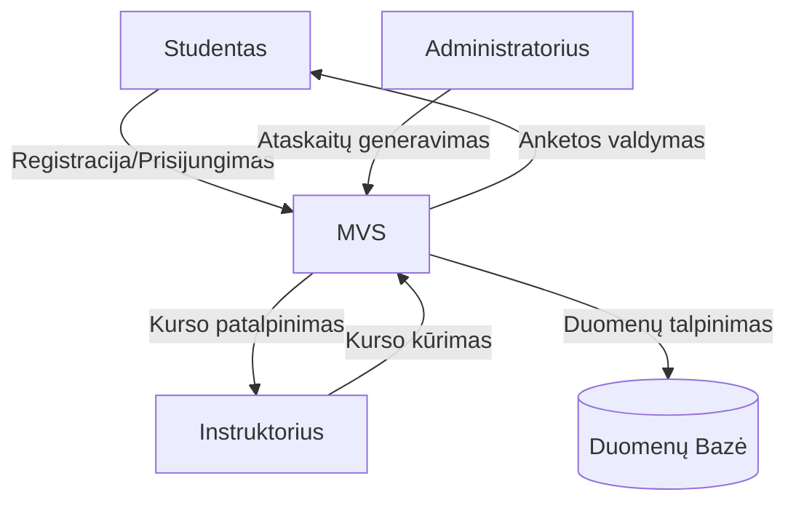
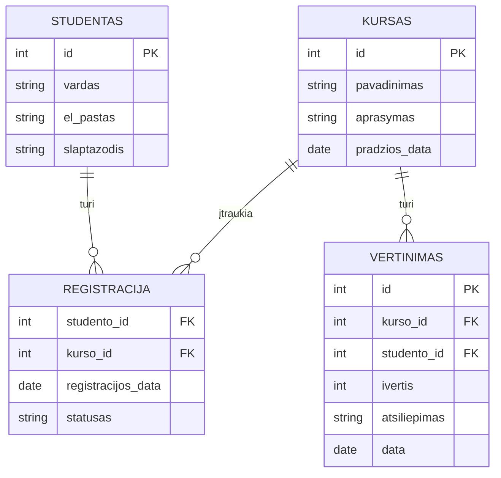
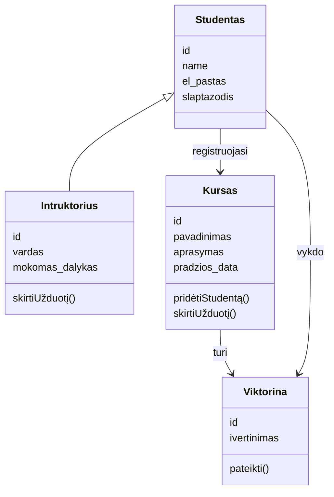
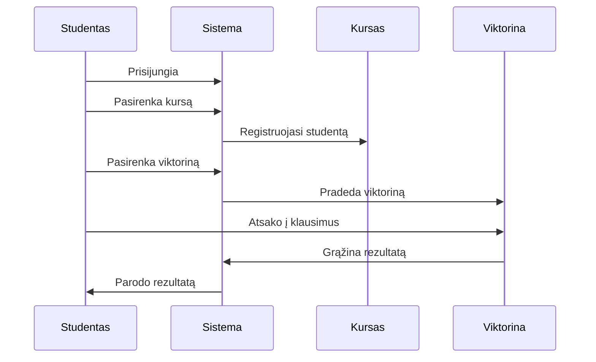

# Diagramos

## DFD 0 lygis: Duomenų srauto tarp vartotojų, kursų ir vertinimų apžvalga.

## ER diagrama: Objektai: Studentas, Kursas, Registracija, Vertinimas.

## Klasių diagrama: Klasės: Studentas, Instruktorius, Kursas, Viktorina.

## Sekos diagrama: Studentas užsiregistruoja į kursą ir atlieka viktoriną.

